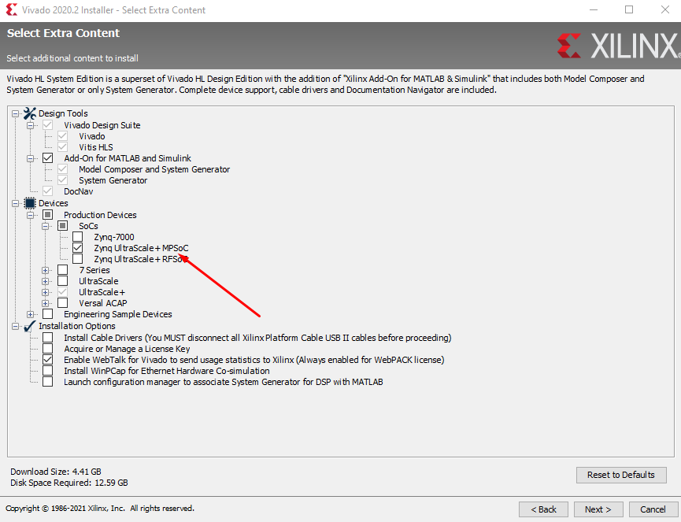
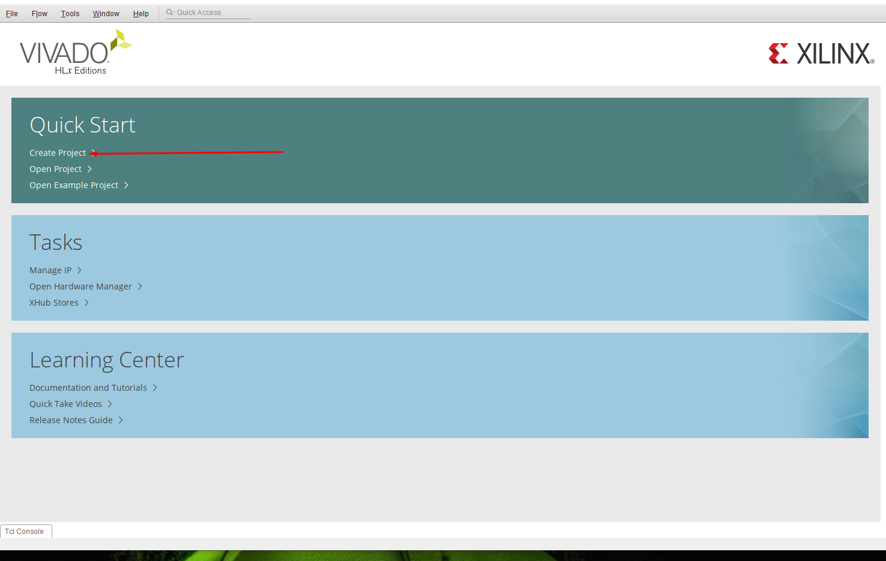
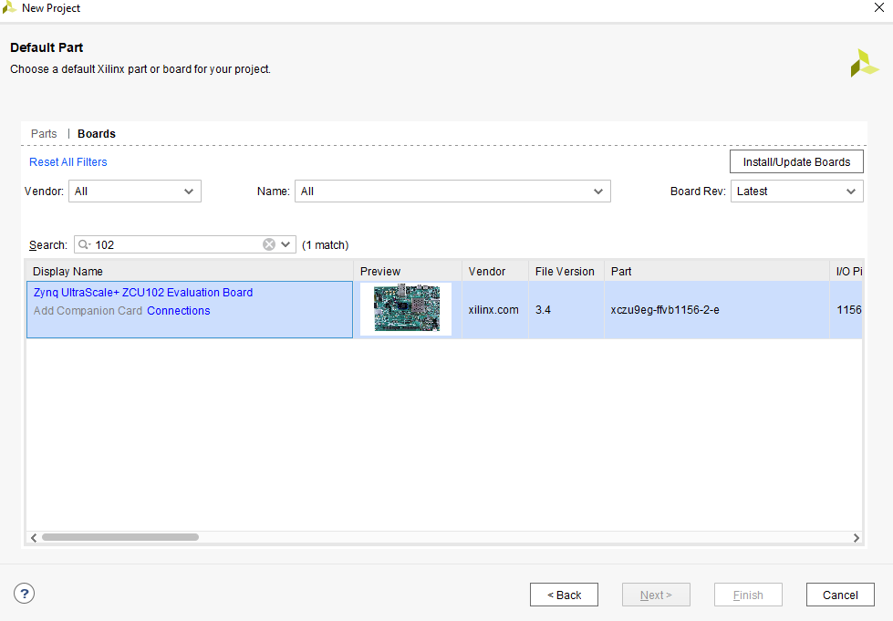
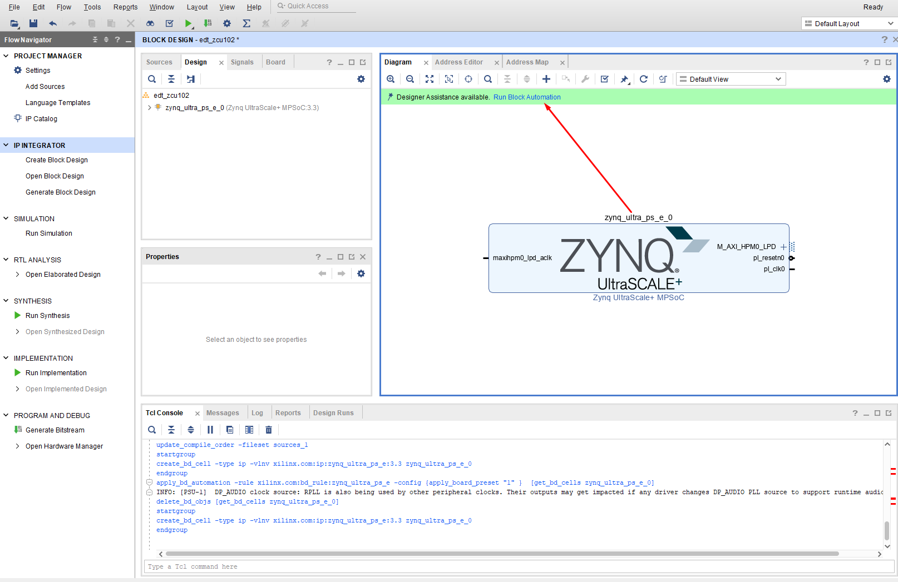
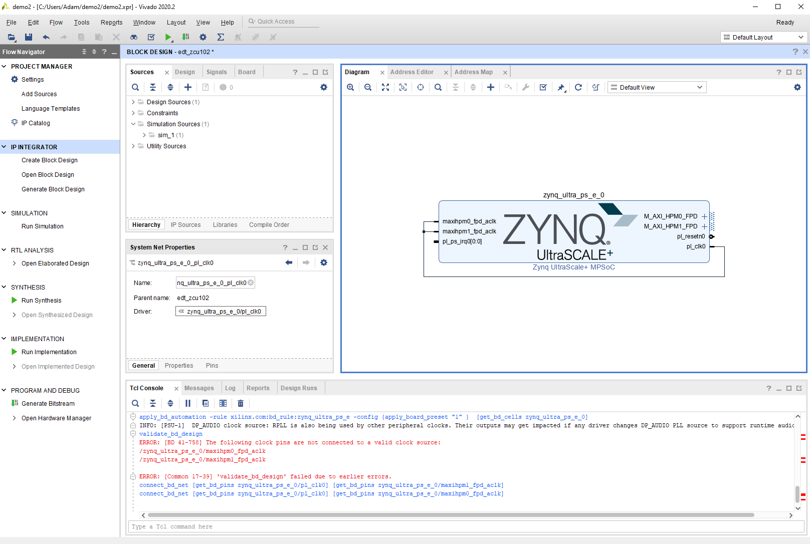
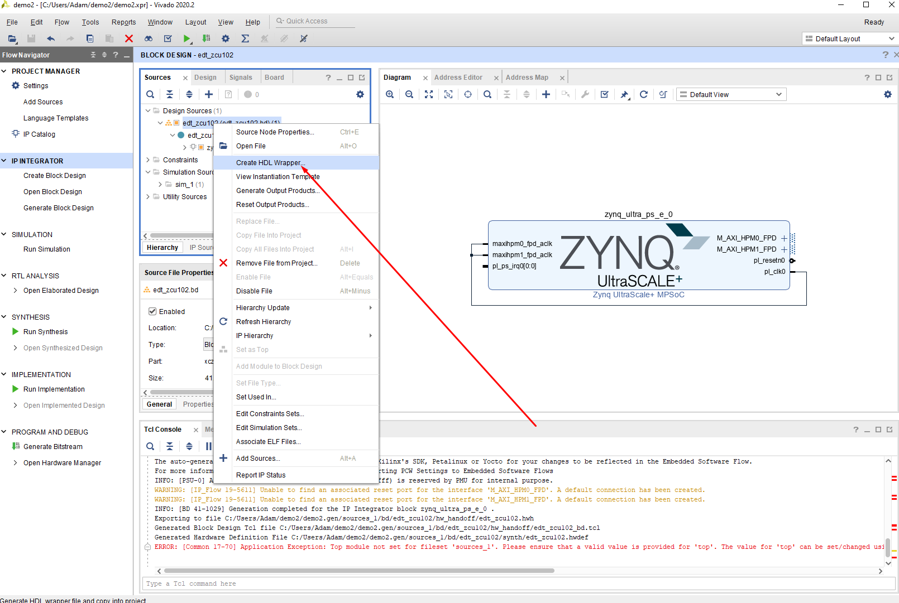
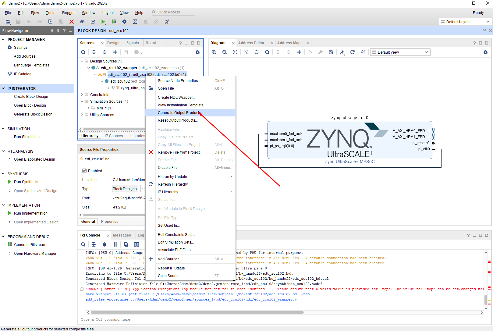

## Baseline Hardware

Baseline instructions for setting up a BSP for a Xilinx devices.  Specific instructions will target the ZCU102 Evaluation Kit, but generically this works for all Xilinx SoC devices.

### Setup

You'll need a [Xilinx Account](https://www.xilinx.com/registration/create-account.html) to install the required software.

If you're using a ZCU102 Evaluation Kit, a license voucher should be included on the back of your Quick Start Guide.  You'll want to generate a Node-Locked license, or whatever meets your organization's license requirements.

#### Install Vivado

I ran this using Windows 10, but the workflow should be roughly the same on Ubuntu.

Install [Vivado Design Suite 2020.2](https://www.xilinx.com/products/design-tools/vivado.html)

Make sure to install support for Zynq Ultrascale+ boards

When prompted, load the license file downloaded from Xilinx.

Select the following options when stepping through the installer:

* Product: Vivado
* Edition: Vivado HL System Edition
* Devices: Zynq Ultrascale+ MPSoC


### Create Baseline Vivado Project

Primarily following the guide from [Xilinx](https://www.xilinx.com/support/documentation/sw_manuals/xilinx2018_3/ug1209-embedded-design-tutorial.pdf).
#### Project Setup

We'll start by creating a project in Vivado with the most basic configuration for the PL layer in the SoC.

Open Vivado and click `Quick Start -> Create Project`:



Use the following settings when creating your project:

* Project name: `zcu102_demo`
* Project Type: `RTL Project` (leave the checkboxes underneath RTL project unchecked)
* Add Sources: Make no changes
* Add Constraints: Make no changes
* Select "Boards"
    * Select "ZCU102 Evaluation Board"
    

#### Block Diagram

The baseline PL layer for the board exists as an IP block in Vivado.  Lets create a block diagram and place this block.

* In the `Flow Navigator` on the left, click `IP Integrator -> Create Block Design`
    * Use the default settings for the new block design
* On the Diagram tab, select the `+` button to add a new IP block, then add the `Zynq Ultrascale+ MPSoC` block.
* Click the `Run Block Automation` button to generate the required connections:

    * Use the default options and click OK
* Connect `pl_clk0` to `maxihpm0_fpd_aclk` and `maxihpm1_fpd_aclk`


#### Export Hardware Package

We'll now generate a hardware bitstream and Petalinux support package.

* Under `Design Sources`, right click the `edt_zcu102.bd` board file and click "Create HDL Wrapper"

* Expand the newly created wrapper, right click the board file again, and click "Generate Output Products"

* Under the Flow Navigator, click on `Program and Debug -> Generate Bitstream`
* Export the hardware by clicking `File -> Export -> Export Hardware`
    * Choose `Include bitstream` from the output options


## Baseline Petalinux BSP

Created using Ubuntu 20.04

### Install Petalinux

Download the Petalinux installer from [Xilinx](https://www.xilinx.com/support/download/index.html/content/xilinx/en/downloadNav/embedded-design-tools/2020-2.html); you should have the `petalinux-v2020.2-final-installer.run` file.

#### Native OS Install

Install the requirements by executing `rake install_requirements`

Install Petalinux by executing `./petalinux-v2020.2-final-installer.run -d ~/petalinux`.  Accept the license agreement, and install where appropriate for your system.

### Create Baseline Petalinux Project

#### Setup Environment

Set an environment variable to the directory you installed petalinux, e.g.

`export PETALINUX_DIR=~/petalinux/`

Setup the environment:

`source $PETALINUX_DIR/settings.sh`

#### Create Project

Navigate to where you want to create the project, then run

`petalinux-create -t project -n <PROJECT_NAME> --template zynqMP`

Or, using the rake system:

```
rake set_project[<PROJECT_NAME>]
rake create_project
```

#### Import Hardware Configuration

Now we'll import the `.xsa` file generated earlier by executing

`petalinux-config --get-hw-description <PATH_TO_XSA_FILE>`

Or, using the rake system:

```
rake set_project[<PROJECT_NAME>]
rake import_hardware[<PATH_TO_XSA_FILE>]
```
