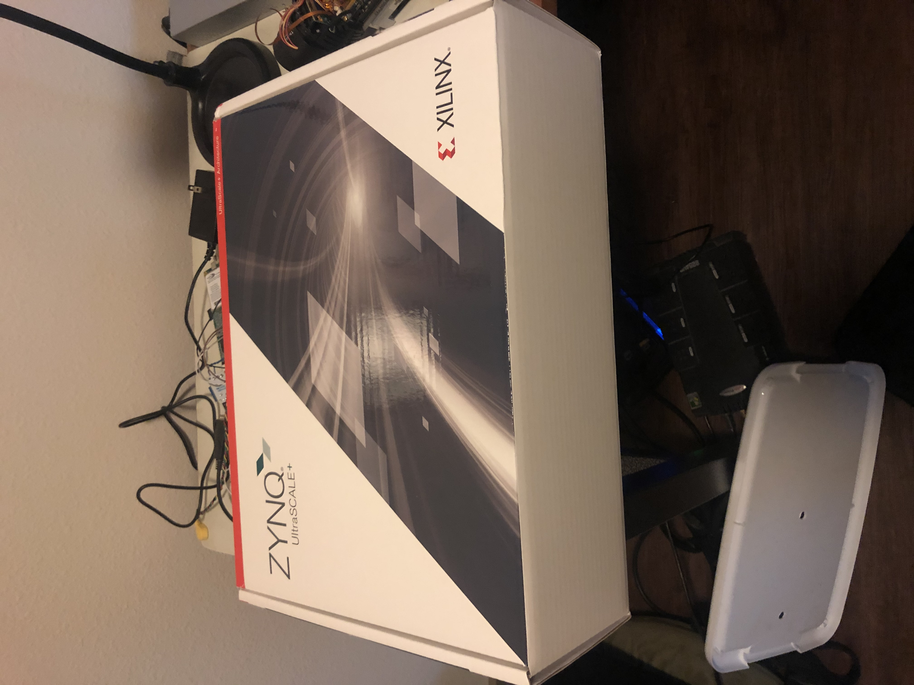
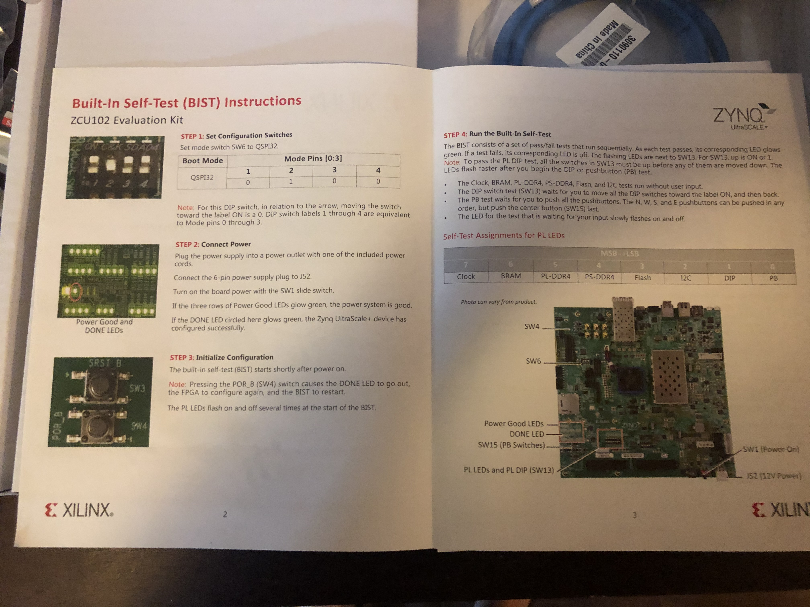
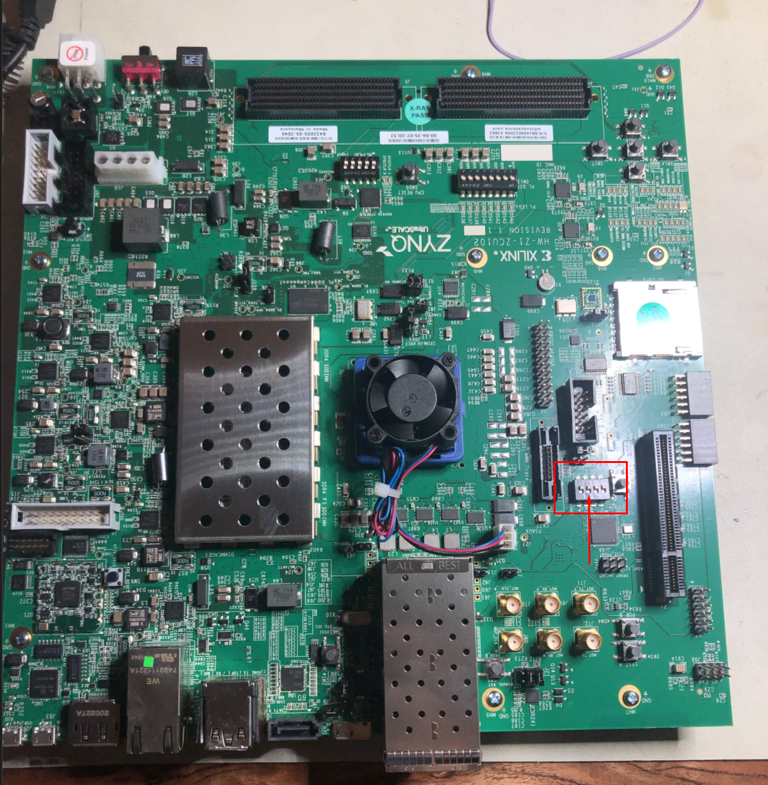
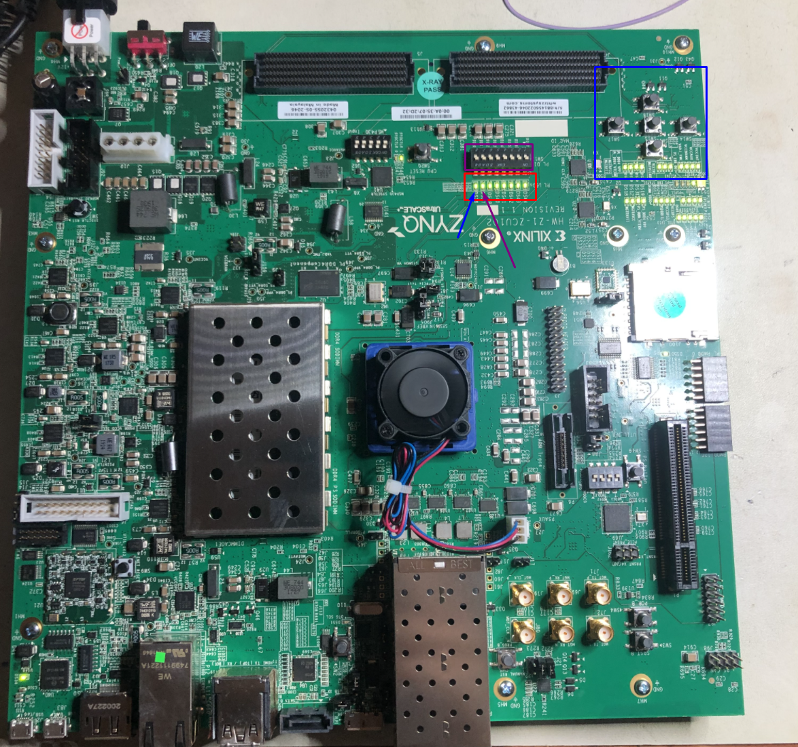

## Zynq ZCU102 Evaluation Kit Unboxing

This post will describe the unboxing and self-test procedure for the Xilinx Zynq ZCU102 Evaluation kit, targeting the Zynq Ultrascale+ SoC.

Before unboxing the board, you'll notice the built-in self test instructions.

Here is our main board, oriented with the power connector and switch in the upper-left:

Lets start by configuring SW6 for BIST mode, by setting position 2 to 1, and setting the remaining positions to 0.  You can accomplish this by moving the highlighted DIP below to the LOWER position:

Plug the power connector into the upper-left portion of the board, and power on the board by flipping the red switch next to the power connector.

The Built-In Self Test will start; you can determine its status via the LEDs shown in RED below:

As the test progress, the LEDs will start turning on from left to right as each individual test passes.

When the 6th test (shown in purple below) starts, the LED will flash.  This indicates the DIP switch test is waiting for user input.  Flip all of the switched in the PURPLE box to the enabled position, then move them all back to the disabled position.  The LED will hold solid on, and move on to the final test.

When the 7th test (shown in blue below) starts, the LED will flash.  This is the pushbutton test.  To run the test, press all of the directions (in any order) first, then press the center button.  The LED will hold solid on.

Once all of the LEDs shown in the RED box are on, the BIST has passed, and you can proceed knowing your hardware is functional.